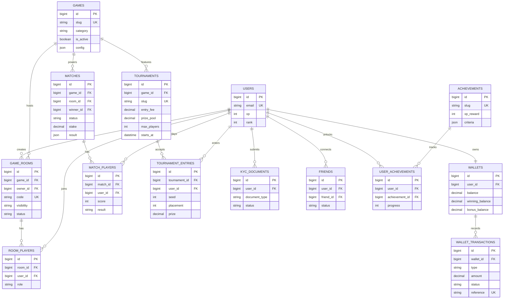

# Nexora data model

The production schema is in `backend/database/migrations/2026_01_01_000000_create_nexora_schema.php` and is designed for MySQL 8.4. Monetary values use fixed-point `DECIMAL(14,2)` and every balance mutation is protected by a row lock inside a database transaction.

## Integrity rules

- `wallets` has one row per user; never update a wallet without `lockForUpdate()` inside `DB::transaction()`.
- A user can enter a tournament once (`tournament_id`, `user_id` unique key).
- A user can be a player in a room once (`room_id`, `user_id` unique key).
- Game and tournament lists are indexed for matchmaking (`is_active`, `category`, `status`, `starts_at`).
- `audit_logs` stores privileged/admin changes and KYC reviews.
